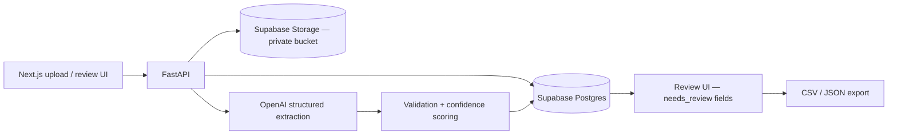

# DocForge AI — Document Extraction & Review Platform

DocForge AI converts unstructured invoice PDFs into validated, structured data. Every extracted field carries a confidence score, and anything the validator doesn't trust is routed to a human review screen before the data can be exported as CSV or JSON.

## Case study (fictional)

**Northstar Accounting** — a synthetic client persona — needed to reduce manual invoice entry. AP staff were re-keying PDF invoices into spreadsheets: slow, error-prone, and impossible to audit.

DocForge AI is the v0.1 answer: upload a PDF, get back a strict invoice schema with per-field confidence, review only the flagged fields, approve, export.

**This is a synthetic portfolio demo, not real client work.** Every sample document is generated with Faker + ReportLab (`samples/invoices/`). No real client documents were used at any point.

## Demo flow

The deterministic low-confidence sample proves the human-review path end to end:

1. Upload [`samples/invoices/invoice_004_low_confidence.pdf`](samples/invoices/invoice_004_low_confidence.pdf).
2. Extraction runs: text layer → OpenAI structured output → validation.
3. The totals validator flags `subtotal`, `tax`, and `total` as `needs_review` because 2441.33 + 195.31 != 2700.00 (expected 2636.64). The document lands in `needs_review`.
4. The reviewer corrects `total` to **2636.64** in the review UI.
5. **Approve** re-validates all fields, moves the document to `approved`, and unlocks CSV/JSON export.

## Screenshots

<!-- TODO: capture screenshots locally and replace the placeholder files in docs/assets/ -->

<!-- TODO: capture docs/assets/upload.png locally -->


<!-- TODO: capture docs/assets/review-low-confidence.png locally -->


<!-- TODO: capture docs/assets/approved-export.png locally -->


<!-- TODO: capture docs/assets/architecture.png locally -->


## Architecture



The browser never talks to Supabase directly. All storage and database access goes through the FastAPI service layer.

## Setup

Prerequisites: Python 3.11+, Node.js 20+, a Supabase project, an OpenAI API key. Optional for scanned PDFs: Tesseract OCR.

1. **Clone the repo**

   ```bash
   git clone <repo-url> && cd DocForge
   ```

2. **Create a Supabase project** (free tier is fine).

3. **Apply the schema** — run [`supabase/migrations/001_init.sql`](supabase/migrations/001_init.sql) in the Supabase SQL Editor.

4. **Create a private Storage bucket** named `invoices` (PDF MIME type). It must stay private.

5. **Configure the API env**

   ```bash
   cp .env.example apps/api/.env
   ```

   Fill in: `SUPABASE_URL`, `SUPABASE_SERVICE_ROLE_KEY`, `SUPABASE_STORAGE_BUCKET`, `OPENAI_API_KEY`, `OPENAI_MODEL`, `API_CORS_ORIGINS`.

6. **Configure the web env**

   ```bash
   cp apps/web/.env.local.example apps/web/.env.local
   ```

   Set `NEXT_PUBLIC_API_URL=http://localhost:8000` — the only variable the browser ever sees.

7. **Run the API**

   ```bash
   cd apps/api
   python3 -m venv .venv && source .venv/bin/activate
   pip install -r requirements.txt
   uvicorn main:app --reload --host 0.0.0.0 --port 8000
   ```

   Health: http://localhost:8000/health · Swagger: http://localhost:8000/docs

8. **Run the web app**

   ```bash
   cd apps/web
   npm install
   npm run dev
   ```

   Open http://localhost:3000

9. **Generate the sample invoices**

   ```bash
   source apps/api/.venv/bin/activate && python apps/api/scripts/generate_samples.py
   ```

## API endpoints

| Method | Path | Purpose |
|--------|------|---------|
| `POST` | `/documents` | Upload PDF |
| `GET` | `/documents/{id}` | Document metadata |
| `POST` | `/documents/{id}/extract` | Run extraction (upserts fields) |
| `GET` | `/documents/{id}/fields` | Extracted fields with confidence |
| `POST` | `/documents/{id}/review` | Save edits / approve |
| `GET` | `/documents/{id}/export.csv` | CSV export (approved only) |
| `GET` | `/documents/{id}/export.json` | JSON export (approved only) |
| `GET` | `/documents/{id}/file` | Signed URL for the private bucket |
| `GET` | `/documents/{id}/file.pdf` | Stream the PDF through the API |

Status flow: `uploaded` → `processing` → `needs_review` | `approved` → `exported`

## Data model

**`documents`** — one row per uploaded file: `id` (uuid), `file_path`, `original_filename`, `status` (check-constrained to the five states above), `created_at`, `updated_at`.

**`extracted_fields`** — one row per field per document: `document_id` (FK, cascade), `field_name`, `field_value`, `confidence` (numeric), `needs_review` (bool), `reviewed_value`. Unique on `(document_id, field_name)`, so re-extraction upserts instead of duplicating. `line_items` is stored as one JSON field in v0.1.

**`review_events`** — append-only audit log: `document_id` (FK, cascade), `action`, `payload` (jsonb), `created_at`.

## Validation and confidence

Extraction output is validated deterministically before it reaches the review UI (`apps/api/extract/validate.py`):

- **Required fields**: vendor, invoice number, invoice date, due date, subtotal, tax, total.
- **Dates** must parse against known formats; **money fields** must parse as decimal numbers.
- **Totals check**: `subtotal + tax` must equal `total` within a 0.05 tolerance. A mismatch caps `subtotal`, `tax`, and `total` at 0.5 confidence with `needs_review=true` and reason `totals_mismatch`.
- Any field below the confidence threshold (0.8, configurable via `CONFIDENCE_THRESHOLD`) is marked `needs_review=true`.
- Any flagged field or validation error moves the whole document to `needs_review`; a clean document auto-approves.

## Security notes

- The Supabase **service role key is server-only** (FastAPI). It is never exposed to Next.js or any `NEXT_PUBLIC_*` variable.
- The `invoices` bucket is **private**; the browser never talks to Storage directly.
- File access goes through FastAPI only: `GET /documents/{id}/file` (signed URL) or `GET /documents/{id}/file.pdf` (streamed through the API).
- RLS is enabled with no public policies: v0.1 is a service-role, local-demo-only setup with no anon client access.

## Limitations

- Synthetic sample data only — no real client documents.
- Single-user local demo; no multi-tenancy.
- Confidence is heuristic (LLM self-reported scores + deterministic checks), not calibrated.
- No auth, no dashboard, no Google Sheets export, no Docker, no deployment.

## Roadmap

- Eval harness with a 20–30 sample corpus and measured field accuracy.
- Architecture assets and a Loom walkthrough.
- Auth and per-user document scoping.
- Dashboard metrics (auto-approve rate, median review time).
- Google Sheets export.
- Docker and cloud deployment.

## v0.1 done criteria

- [x] Upload PDF → private Storage bucket + `documents` row
- [x] OpenAI structured extraction into a strict invoice schema
- [x] Deterministic validation: required fields, dates, money, totals
- [x] Per-field confidence with `needs_review` flags
- [x] Review UI (PDF left, fields right) with save + approve
- [x] CSV/JSON export gated on approval
- [x] Deterministic low-confidence sample proving the review path
- [ ] Screenshots and architecture image captured locally
- [ ] Loom walkthrough recorded

## License

Private portfolio project — no license file yet. Ask before forking or redistributing.
