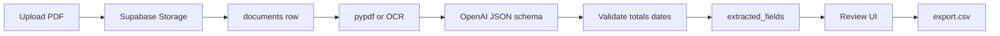

# DocForge AI

Invoice document extraction demo framed as a fictional client case study: **Northstar Accounting** needed to reduce manual invoice entry.

## Problem → Solution → Results → Tech stack

| | |
|---|---|
| **Problem** | Manual AP entry is slow and error-prone. |
| **Solution** | Upload a PDF → extract a strict invoice schema → flag low-confidence fields → human review → export CSV/JSON. |
| **Results (v0.1)** | Measure honestly on the synthetic sample set: field accuracy, % auto-approved, median review time, export success. Portfolio Loom / screenshots come after the demo path is solid. |
| **Tech stack** | Next.js + TypeScript + Tailwind · FastAPI + Python · Supabase Postgres + private Storage · pypdf/pdfplumber · optional Tesseract OCR · OpenAI structured outputs |



## v0.1 scope

One vertical slice — nothing else yet:

1. Upload a PDF invoice  
2. Store file in **private** Supabase Storage + `documents` row  
3. Extract text → OpenAI JSON schema → validate totals/dates  
4. Review UI (PDF left, fields right)  
5. Export CSV / JSON  

Skipped: auth, Docker, dashboards, Google Sheets, background workers, eval harness, 20–30 sample corpus.

## Repo layout

```
apps/api/                 FastAPI backend
apps/web/                 Next.js frontend
supabase/migrations/      Postgres schema
samples/invoices/         3 synthetic PDFs + ground-truth JSON
evals/                    Eval scripts (later)
```

Sample invoices are **synthetic only** (Faker + ReportLab). Never use real client documents.

## Prerequisites

- Python 3.11+  
- Node.js 20+  
- A [Supabase](https://supabase.com) project  
- An [OpenAI](https://platform.openai.com) API key  
- Optional for scanned PDFs: [Tesseract OCR](https://github.com/tesseract-ocr/tesseract) (`brew install tesseract` on macOS)

## Quick start

### 1. Environment

```bash
cp .env.example .env
cp apps/web/.env.local.example apps/web/.env.local
```

Fill **repo-root** `.env` (API only):

| Variable | Where to get it |
|----------|-----------------|
| `SUPABASE_URL` | Project Settings → API → Project URL |
| `SUPABASE_SERVICE_ROLE_KEY` | Project Settings → API → `service_role` (**server only — never expose to Next.js**) |
| `SUPABASE_STORAGE_BUCKET` | `invoices` |
| `OPENAI_API_KEY` | OpenAI dashboard |
| `OPENAI_MODEL` | `gpt-4o-mini` (default) |

Web app gets **only**:

```
NEXT_PUBLIC_API_URL=http://localhost:8000
```

### 2. Supabase

1. Run [`supabase/migrations/001_init.sql`](supabase/migrations/001_init.sql) in the SQL Editor (or apply via Supabase MCP).  
2. Create a **private** Storage bucket named `invoices` (PDF MIME type).  

The browser never talks to Storage directly. Preview uses `GET /documents/{id}/file.pdf` (API stream) or `GET /documents/{id}/file` (signed URL).

### 3. Backend

```bash
cd apps/api
python3 -m venv .venv
source .venv/bin/activate
pip install -r requirements.txt
uvicorn main:app --reload --host 0.0.0.0 --port 8000
```

- Health: http://localhost:8000/health  
- Swagger: http://localhost:8000/docs  

### 4. Frontend

```bash
cd apps/web
npm install
npm run dev
```

Open http://localhost:3000

### 5. Demo script

1. Upload [`samples/invoices/invoice_001.pdf`](samples/invoices/invoice_001.pdf)  
2. Wait for extraction → review screen  
3. Edit a field → **Save review** → **Approve**  
4. **Export CSV** or **Export JSON**  

Regenerate samples anytime:

```bash
cd apps/api && source .venv/bin/activate && python scripts/generate_samples.py
```

## API

| Method | Path | Purpose |
|--------|------|---------|
| `POST` | `/documents` | Upload PDF |
| `GET` | `/documents/{id}` | Document metadata |
| `POST` | `/documents/{id}/extract` | Run extraction (upserts fields) |
| `GET` | `/documents/{id}/fields` | Extracted fields |
| `POST` | `/documents/{id}/review` | Save edits / approve |
| `GET` | `/documents/{id}/export.csv` | CSV export (approved only) |
| `GET` | `/documents/{id}/export.json` | JSON export (approved only) |
| `GET` | `/documents/{id}/file` | Signed URL (private bucket) |
| `GET` | `/documents/{id}/file.pdf` | Stream PDF through API |

### Status transitions

`uploaded` → `processing` → `needs_review` \| `approved` → `exported`

- Re-extract from `uploaded` / `needs_review` / `approved` (unique on `document_id, field_name` → upsert, no duplicates).  
- Approve only when required fields validate (dates, money, totals).  
- Export only from `approved`.  
- No text layer + OCR unavailable → `needs_review` with a clear error (no crash).

## Extraction schema

```json
{
  "vendor": "",
  "invoice_number": "",
  "invoice_date": "",
  "due_date": "",
  "subtotal": "",
  "tax": "",
  "total": "",
  "line_items": [
    { "description": "", "quantity": "", "unit_price": "", "amount": "" }
  ]
}
```

`line_items` is stored as one JSON field in v0.1 (editable textarea).

## License

Private portfolio project — no license file yet. Ask before forking or redistributing.
